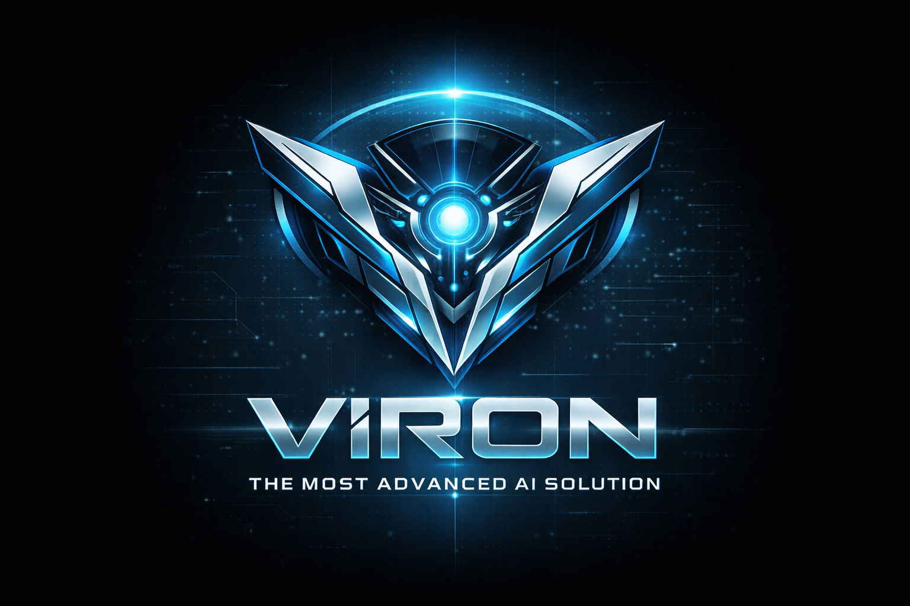

# VIRON 🤖

**AI Companion Robot — Your Best Friend, Tutor & Everything**

VIRON is an interactive AI-powered robot companion with an animated face, real-time emotion detection, voice interaction, and a "Hey VIRON" wake word system. Built for the NVIDIA Jetson Orin Nano.



## ✨ Features

- **43 Animated Emotions** — From happy to mindblown, each with unique eye, mouth, and brow animations
- **"Hey VIRON" Wake Word** — Always listening, activates with a natural voice command
- **Bilingual Voice** — Fluent in English & Greek with natural speech synthesis
- **Student Emotion Detection** — Real-time OpenCV facial analysis detects student mood (happy, sad, confused, bored, sleepy, frustrated, etc.)
- **Proactive Care** — Automatically responds when student is struggling, bored, or distracted
- **YouTube Music Playback** — Ask VIRON to play any song
- **Interactive Whiteboard** — Visual teaching mode for math, science, and step-by-step explanations
- **Animated Boot Splash** — Custom boot screen with VIRON branding (no Ubuntu desktop visible)
- **Full Hardware Integration** — Wi-Fi, battery, brightness, volume, shutdown controls

## 📁 Project Structure

```
VIRON/
├── viron-complete.html        # Main face UI (wake word, emotions, voice, YouTube)
├── setup-local.sh             # Ubuntu desktop setup script
├── run.sh                     # Start everything (Ollama + AI Router + Face Server)
├── ai-router/                 # Smart AI routing system
│   ├── main.py                # FastAPI server (port 8000)
│   ├── ai_router.py           # Complexity analyzer + multi-provider routing
│   ├── emotion_detector.py    # Text → face emotion mapping
│   ├── safety_filter.py       # Age-based content filtering
│   ├── config.py              # Settings from .env
│   ├── .env.example           # Config template
│   ├── requirements.txt       # Python dependencies
│   └── setup.sh               # AI router setup
├── backend/
│   ├── server.py              # Flask backend (proxies to AI router, emotion detection)
│   ├── config.example.json    # Config template (copy to config.json)
│   ├── boot.html              # Animated boot splash screen
│   ├── setup.sh               # Jetson Orin Nano setup script
│   ├── setup-bootsplash.sh    # Plymouth boot theme installer
│   └── viron-logo.png         # VIRON logo
└── README.md
```

## 🛠 Hardware Requirements

| Component | Model |
|---|---|
| Compute | NVIDIA Jetson Orin Nano |
| Display | 10.1" QLED (HDMI) |
| Camera | Logitech Brio (USB) |
| Microphone | ReSpeaker Mic Array (USB) |
| Speakers | Visaton PL 5 RV × 2 |
| Amplifier | TPA3116 |
| Power | 21700 batteries + UPS module |

## 🚀 Quick Setup

### Local Development (Ubuntu Desktop)

```bash
# 1. Clone the repo
git clone https://github.com/giannakkas/VIRON.git
cd VIRON

# 2. Run local setup (installs Flask, OpenCV)
sudo bash setup-local.sh

# 3. Setup AI Router (installs FastAPI, configures API keys)
bash ai-router/setup.sh

# 4. Start everything
./run.sh

# 5. Open in browser
# http://localhost:5000
```

### Production (Jetson Orin Nano)

```bash
# 1. Clone the repo
git clone https://github.com/giannakkas/VIRON.git
cd VIRON

# 2. Run Jetson setup (installs everything + kiosk autostart)
sudo bash backend/setup.sh

# 3. Reboot — VIRON starts automatically
sudo reboot
```

## 🎤 How It Works

1. **VIRON sits idle** with a neutral face, passively listening
2. **Student says "Hey VIRON"** → eyes widen, sparkle appears (hopeful expression)
3. **Student speaks** → VIRON listens actively with focused expression
4. **AI processes** → thinking expression while generating response
5. **VIRON responds** with appropriate emotion + voice + subtitles
6. **Returns to idle** listening for the next wake word

## 🧠 AI Architecture

```
Student speaks → Face UI (port 5000) → Flask Backend → AI Router (port 8000)
                                                              │
                                                    ┌────────┴────────┐
                                                    ▼                 ▼
                                              [Simple Q]        [Complex Q]
                                                    │                 │
                                              Ollama Local      Cloud AI
                                              (phi3 3.8B)   ┌────┼────┐
                                                    │        ▼    ▼    ▼
                                                    │     Claude Gemini ChatGPT
                                                    └────────┬────────┘
                                                             ▼
                                                    Safety Filter + Emotion
                                                             ▼
                                                    Voice Response + Face Animation
```

- **Smart Routing**: Simple questions → local Ollama (fast, offline). Complex → cloud (Claude/Gemini/ChatGPT)
- **Confidence Gating**: If local LLM seems uncertain, auto-escalates to cloud
- **Safety Filter**: Age-based content filtering (kids 5-10, teens 11-15, young adults 16-18, adults 18+)
- **Response Cache**: SQLite caching to avoid repeated API calls
- **Emotion Detection**: Real-time student facial analysis via OpenCV

## 🎭 Emotion List

happy, excited, sad, angry, surprised, sleepy, love, neutral, teasing, confused, scared, disgusted, proud, shy, bored, laughing, crying, thinking, winking, suspicious, grateful, mischievous, worried, hopeful, sassy, dizzy, cheeky, flirty, jealous, determined, embarrassed, mindblown, smug, evil, dreamy, focused, relieved, skeptical, panicking, silly, grumpy, amazed, zen

## 📄 License

MIT

---

*Built with ❤️ for students everywhere*
