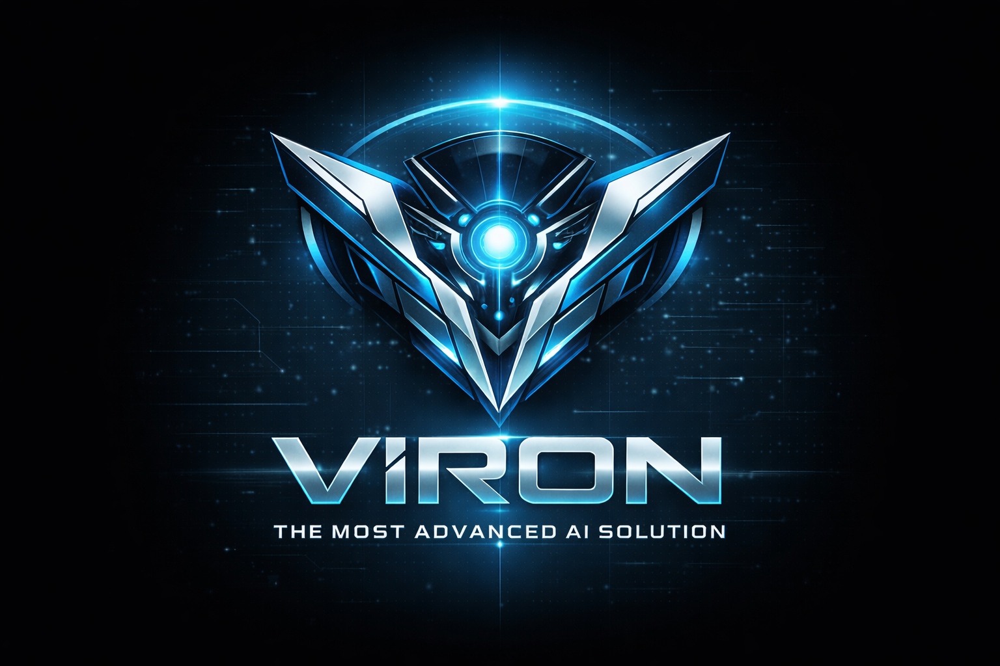

# VIRON 🤖

**AI Companion Robot — Your Best Friend, Tutor & Everything**

VIRON is an interactive AI-powered robot companion with an animated face, real-time emotion detection, voice interaction, and a "Hey VIRON" wake word system. Built for the NVIDIA Jetson Orin Nano.



## ✨ Features

- **43 Animated Emotions** — From happy to mindblown, each with unique eye, mouth, and brow animations
- **"Hey VIRON" Wake Word** — Always listening, activates with a natural voice command
- **Bilingual Voice** — Fluent in English & Greek with natural speech synthesis
- **Student Emotion Detection** — Real-time OpenCV facial analysis detects student mood (happy, sad, confused, bored, sleepy, frustrated, etc.)
- **Proactive Care** — Automatically responds when student is struggling, bored, or distracted
- **YouTube Music Playback** — Ask VIRON to play any song
- **Interactive Whiteboard** — Visual teaching mode for math, science, and step-by-step explanations
- **Animated Boot Splash** — Custom boot screen with VIRON branding (no Ubuntu desktop visible)
- **Full Hardware Integration** — Wi-Fi, battery, brightness, volume, shutdown controls

## 📁 Project Structure

```
VIRON/
├── voice_pipeline.py             # Standalone voice pipeline (Porcupine + Deepgram + Groq)
├── viron-complete.html           # Main face UI (wake word, emotions, voice, YouTube)
├── gateway/                      # FastAPI hybrid gateway (port 8080)
│   ├── main.py                   # Intent routing: Gemma 2B local ↔ cloud (ChatGPT/Claude/Gemini)
│   ├── config.py                 # System prompt, model config, routing rules
│   ├── db.py                     # SQLite persistence (profiles, history)
│   └── safety.py                 # Content safety filter
├── backend/
│   ├── server.py                 # Flask backend (port 5000): STT, TTS, face UI serving
│   ├── viron_ai_router.py        # AI routing logic
│   ├── viron_faces.py            # Face animation controller
│   ├── student_profiles.py       # Student profile management
│   └── voice_verify.py           # Voice verification
├── wakeword/                     # Custom wake word training (OpenWakeWord)
│   ├── service.py                # Wake word detection service
│   └── train_hey_viron.py        # Train custom "Hey VIRON" model
├── scripts/
│   ├── setup_autostart.sh        # systemd service setup (backend, gateway, pipeline)
│   ├── health_check.py           # System health diagnostics
│   ├── audio_probe.py            # Mic/audio device testing
│   ├── build_llamacpp.sh         # Build llama.cpp with CUDA for Jetson
│   └── start_all.sh              # Manual start script
├── docs/
│   ├── viron-context-prompt.md   # Full project context for Claude chats
│   ├── buddy-tutor-spec.md       # Buddy Tutor feature specification
│   ├── jetson-setup-guide.md     # Jetson Orin Nano setup guide
│   └── mic-setup.md              # XVF3800 mic configuration
└── README.md
```

## 🛠 Hardware Requirements

| Component | Model |
|---|---|
| Compute | NVIDIA Jetson Orin Nano 8GB (JetPack 6.2.2, CUDA 12.6) |
| Display | Waveshare 10.1" QLED (1280×720, HDMI) |
| Microphone | ReSpeaker XVF3800 4-mic USB array (mono beamformed) |
| Speaker | Connected to XVF3800 headphone jack |

## 🚀 Quick Setup

### Jetson Orin Nano (Production)

```bash
# 1. Clone the repo
git clone https://github.com/giannakkas/VIRON.git
cd VIRON

# 2. Create .env with API keys
cp backend/config.example.json .env
# Edit .env with: OPENAI_API_KEY, PICOVOICE_ACCESS_KEY, GROQ_API_KEY, DEEPGRAM_API_KEY

# 3. Build llama.cpp with CUDA
bash scripts/build_llamacpp.sh

# 4. Setup systemd services
sudo bash scripts/setup_autostart.sh

# 5. Kill PulseAudio and start
pulseaudio --kill; pkill -f arecord; sleep 2
sudo systemctl start viron-backend viron-gateway
sleep 3
sudo systemctl start viron-pipeline

# 6. Check logs
sudo journalctl -u viron-pipeline -f
```

### Test Wake Word

```bash
sudo systemctl stop viron-pipeline
pulseaudio --kill; pkill -f arecord; sleep 2
cd ~/VIRON && python3 voice_pipeline.py 2>&1 | grep -v "GET /\|werkzeug\|snap\|SELinux"
# Say "Hey Jarvis" → should see: WAKE WORD detected (porcupine, score=1.00)
```

## 🎤 How It Works

1. **VIRON sits idle** with a neutral face, passively listening
2. **Student says "Hey VIRON"** → eyes widen, sparkle appears (hopeful expression)
3. **Student speaks** → VIRON listens actively with focused expression
4. **AI processes** → thinking expression while generating response
5. **VIRON responds** with appropriate emotion + voice + subtitles
6. **Returns to idle** listening for the next wake word

## 🧠 AI Architecture

### Voice Pipeline (primary — `voice_pipeline.py`)
```
"Hey Jarvis" → Porcupine Wake Word → Silero VAD → Deepgram STT
                                                        ↓
                                              Route: simple → Groq (llama-3.3-70b)
                                                     complex → Claude / ChatGPT
                                                        ↓
                                              OpenAI TTS → Speaker
```

### Gateway (browser-based — `gateway/main.py`)
```
Browser mic → Silero VAD → Flask STT → Gateway (port 8080)
                                              ↓
                                    Gemma 2B Router (GPU, port 8081)
                                     ┌────────┴────────┐
                                     ▼                  ▼
                               LOCAL (Gemma 2B)    CLOUD (ChatGPT/Claude/Gemini)
                                     └────────┬────────┘
                                              ▼
                                    edge-tts → Browser audio + face animation
```

- **Wake Word**: Porcupine via Picovoice ("jarvis"), sensitivity 0.99
- **STT**: Deepgram streaming (~300ms) with whisper.cpp GPU fallback
- **LLM**: Groq (fast cloud) for simple, Claude/ChatGPT for complex queries
- **TTS**: OpenAI TTS (voice pipeline) or edge-tts (browser path)
- **On-device**: Gemma 2B on GPU (only model that fits 8GB shared RAM)
- **Safety Filter**: Age-based content filtering
- **Language**: Greek primary, English supported

## 🎭 Emotion List

happy, excited, sad, angry, surprised, sleepy, love, neutral, teasing, confused, scared, disgusted, proud, shy, bored, laughing, crying, thinking, winking, suspicious, grateful, mischievous, worried, hopeful, sassy, dizzy, cheeky, flirty, jealous, determined, embarrassed, mindblown, smug, evil, dreamy, focused, relieved, skeptical, panicking, silly, grumpy, amazed, zen

## 📄 License

MIT

---

*Built with ❤️ for students everywhere*
